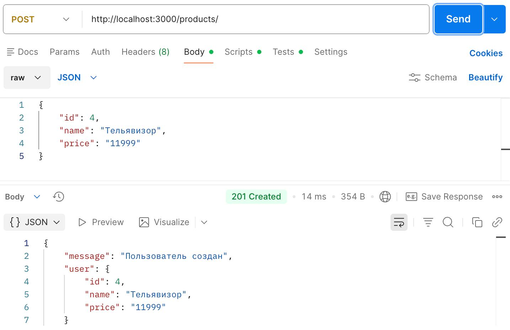
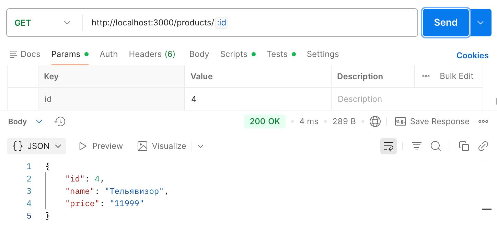
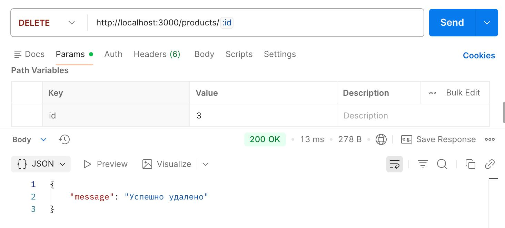
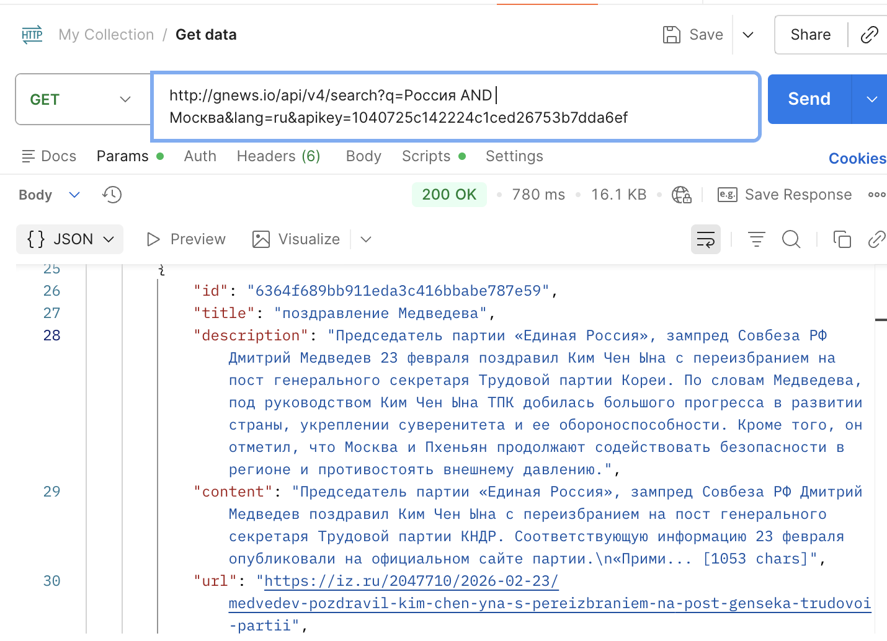
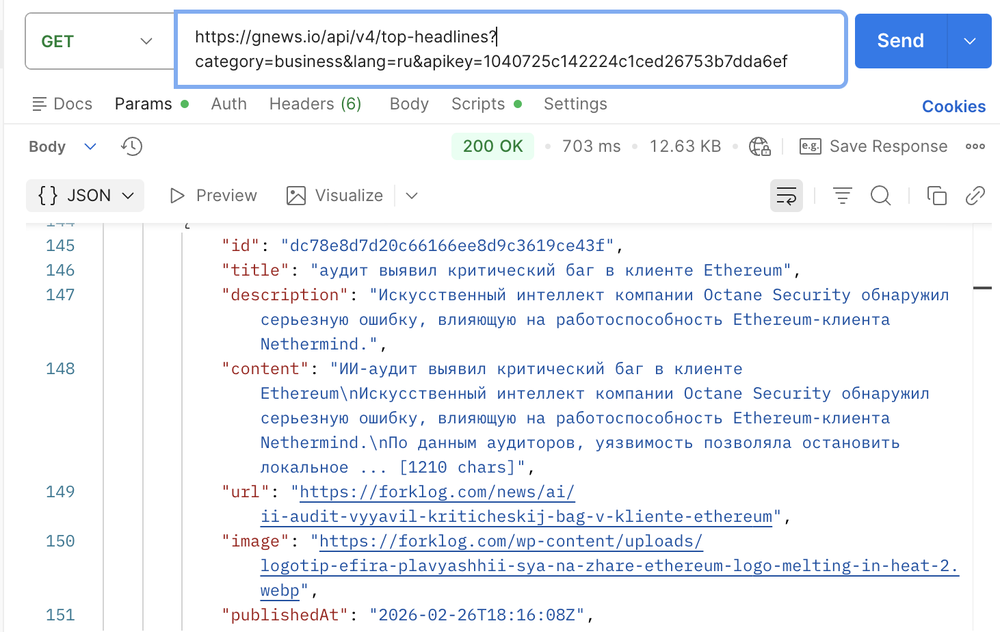
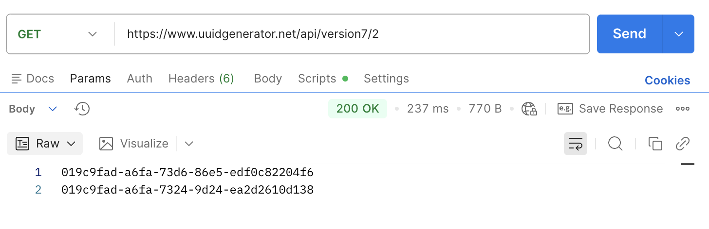
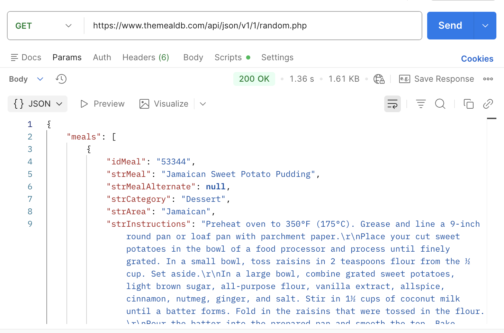

# Запросы к собственному API с товарами (2 практика)

1. Выводим список всех товаров:

2. Добавляем новый элемент post запросом:

Проверяем, действительно ли добавлился такой элемент get запросом по id:

3. Пробуем удалить этот элемент delete запросом:

Проверяем, что элемент действительно теперь отсутствует

# Запросы к публичному API

## API для получения новостей GNews.io

1. Запрос на поиск новости с ключевыми словами "Россия" и "Москва":

2. Запрос на новости по тематике "Бизнес":

## API для получение UUID-ключа (без apikey)

3. GET запрос на получения 2-х UUID ключей

4. API - рецепт случайного блюда

5. API - список блюда с конкретным ингридиентом из query запроса (куриные грудки)

